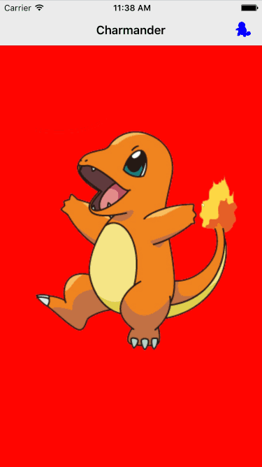
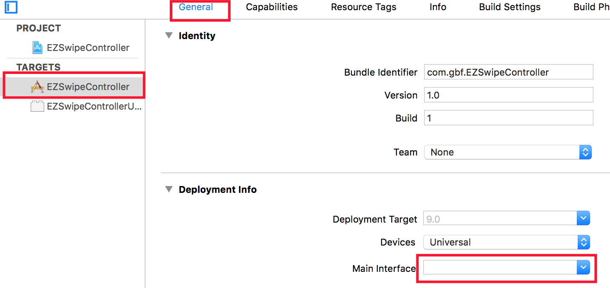
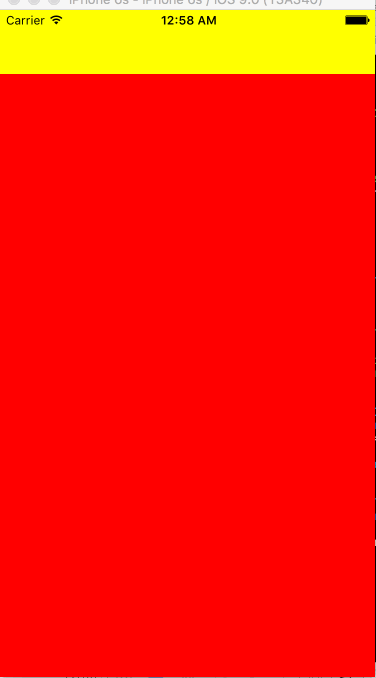
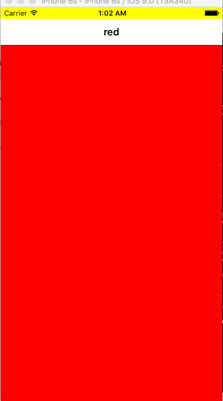
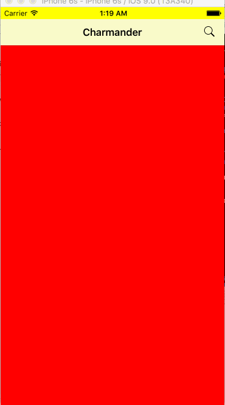
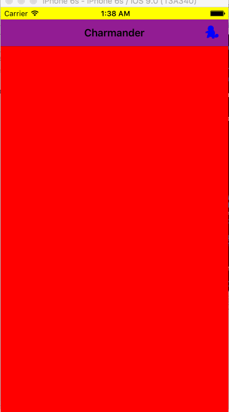
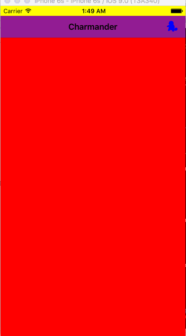
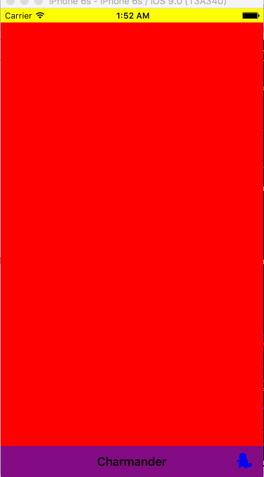

# EZSwipeController

[](https://img.shields.io/cocoapods/v/EZSwipeController.svg)  
[](https://github.com/Carthage/Carthage)

Easy to use UIPageViewController to create a view navigation like Snapchat/Tinder/iOS Main Pages.



##Manual Install (~10 seconds)

1. Download and drop 'EZSwipeController.swift' in your project.  
2. Congratulations!


## Install via CocoaPods (~10 seconds)

You can use [CocoaPods](http://cocoapods.org/) to install `EZSwipeController` by adding it to your `Podfile`:

```ruby
platform :ios, '8.0'
use_frameworks!
pod 'EZSwipeController'
```

``` swift
import EZSwipeController
```

## Install via Carthage (~5 seconds)

[Carthage](https://github.com/Carthage/Carthage) is a decentralized dependency manager that automates the process of adding frameworks to your Cocoa application.

You can install Carthage with [Homebrew](http://brew.sh/) using the following command:

```bash
$ brew update
$ brew install carthage
```

To integrate EZSwipeController into your Xcode project using Carthage, specify it in your `Cartfile`:

```ogdl
github "goktugyil/EZSwipeController"
```
Run `carthage update`.

```bash
$ carthage update
```

##Setup

####Use with Storyboard

You can also use EZSwipeController via push or present on your UIViewcontrollers like: 

``` swift
presentViewController(EZSwipeController(), animated: true, completion: nil)
```

####Use without Storyboard
If you want to use EZSwipe as root viewcontroller (Your apps starting point):

Go to Targets -> Your Target -> General -> Main Interface -> Delete it



Add this to your AppDelegate: 

``` swift
func application(application: UIApplication, didFinishLaunchingWithOptions launchOptions: [NSObject: AnyObject]?) -> Bool {
    window = UIWindow(frame: UIScreen.mainScreen().bounds)
    window!.rootViewController = MySwipeVC()
    window!.makeKeyAndVisible()
    return true
}
```

##Usage

####Create a subclass of EZSwipeController


``` swift
import UIKit
// import EZSwipeController // if using CocoaPods
class MySwipeVC: EZSwipeController {
    override func setupView() {
        datasource = self
    }
}

extension MySwipeVC: EZSwipeControllerDataSource {
    func viewControllerData() -> [UIViewController] {
        let redVC = UIViewController()
        redVC.view.backgroundColor = UIColor.redColor()
        
        let blueVC = UIViewController()
        blueVC.view.backgroundColor = UIColor.blueColor()
        
        let greenVC = UIViewController()
        greenVC.view.backgroundColor = UIColor.greenColor()
        
        return [redVC, blueVC, greenVC]
    }
}
```
You should have something like this:


####Change Background Color

``` swift
class MySwipeVC: EZSwipeController {
    override func viewDidLoad() {
        super.viewDidLoad()
        view.backgroundColor = UIColor.yellowColor()
    }
}
```



####Gives Titles To Pages

``` swift
extension MySwipeVC: EZSwipeControllerDataSource {   
    func titlesForPages() -> [String] {
        return ["red", "blue", "green"]
    }
}
```



####Starting Page Index

``` swift
extension MySwipeVC: EZSwipeControllerDataSource {
    func indexOfStartingPage() -> Int {
        return 2 // EZSwipeController starts from 2nd, green page
    }
}
```

####On Changed Page Index

``` swift
extension MySwipeVC: EZSwipeControllerDataSource {
    func changedToPageIndex(index: Int) {
    	// You can do anything from here, for now we'll just print the new index
        print(index)
    }
}
```

####Custom Navigation Bar

Setting up navigationBarDataForPageIndex overrides effects in titlesForPages.

``` swift

extension MySwipeVC: EZSwipeControllerDataSource {
    func navigationBarDataForPageIndex(index: Int) -> UINavigationBar {
        var title = ""
        if index == 0 {
            title = "Charmander"
        } else if index == 1 {
            title = "Squirtle"
        } else if index == 2 {
            title = "Bulbasaur"
        }

        let navigationBar = UINavigationBar()
        navigationBar.barStyle = UIBarStyle.Default
//        navigationBar.barTintColor = QorumColors.WhiteLight
        print(navigationBar.barTintColor)
        navigationBar.titleTextAttributes = [NSForegroundColorAttributeName: UIColor.blackColor()]
        
        let navigationItem = UINavigationItem(title: title)
        navigationItem.hidesBackButton = true
        
        if index == 0 {
            let rightButtonItem = UIBarButtonItem(barButtonSystemItem: UIBarButtonSystemItem.Search, target: self, action: "a")
            rightButtonItem.tintColor = UIColor.blackColor()
            
            navigationItem.leftBarButtonItem = nil
            navigationItem.rightBarButtonItem = rightButtonItem
        } else if index == 1 {
            let rightButtonItem = UIBarButtonItem(barButtonSystemItem: UIBarButtonSystemItem.Bookmarks, target: self, action: "a")
            rightButtonItem.tintColor = UIColor.blackColor()
            
            let leftButtonItem = UIBarButtonItem(barButtonSystemItem: UIBarButtonSystemItem.Camera, target: self, action: "a")
            leftButtonItem.tintColor = UIColor.blackColor()
            
            navigationItem.leftBarButtonItem = leftButtonItem
            navigationItem.rightBarButtonItem = rightButtonItem
        } else if index == 2 {            
            let leftButtonItem = UIBarButtonItem(barButtonSystemItem: UIBarButtonSystemItem.Search, target: self, action: "a")
            leftButtonItem.tintColor = UIColor.blackColor()
            
            navigationItem.leftBarButtonItem = leftButtonItem
            navigationItem.rightBarButtonItem = nil
        } 
        navigationBar.pushNavigationItem(navigationItem, animated: false)
        return navigationBar
    }
}
```
You don't need to set actions to buttons, EZSwipeController automatically overrides them and makes them work.



####Add Images To Navigation Bar


``` swift
extension MySwipeVC: EZSwipeControllerDataSource {
    func navigationBarDataForPageIndex(index: Int) -> UINavigationBar {
        var title = ""
        if index == 0 {
            title = "Charmander"
        } else if index == 1 {
            title = "Squirtle"
        } else if index == 2 {
            title = "Bulbasaur"
        }

        let navigationBar = UINavigationBar()
        navigationBar.barStyle = UIBarStyle.Default
        navigationBar.barTintColor = UIColor.purpleColor()
        navigationBar.titleTextAttributes = [NSForegroundColorAttributeName: UIColor.blackColor()]
        
        let navigationItem = UINavigationItem(title: title)
        navigationItem.hidesBackButton = true
        
        if index == 0 {
            var sImage = UIImage(named: "squir")!
            sImage = scaleTo(image: sImage, w: 22, h: 22)
            let rightButtonItem = UIBarButtonItem(image: sImage, style: UIBarButtonItemStyle.Plain, target: self, action: "a")
            rightButtonItem.tintColor = UIColor.blueColor()
            
            navigationItem.leftBarButtonItem = nil
            navigationItem.rightBarButtonItem = rightButtonItem
        } else if index == 1 {
            var cImage = UIImage(named: "char")!
            cImage = scaleTo(image: cImage, w: 22, h: 22)
            let leftButtonItem = UIBarButtonItem(image: cImage, style: UIBarButtonItemStyle.Plain, target: self, action: "a")
            leftButtonItem.tintColor = UIColor.redColor()
            
            var bImage = UIImage(named: "bulb")!
            bImage = scaleTo(image: bImage, w: 22, h: 22)
            let rightButtonItem = UIBarButtonItem(image: bImage, style: UIBarButtonItemStyle.Plain, target: self, action: "a")
            rightButtonItem.tintColor = UIColor.greenColor()
            
            navigationItem.leftBarButtonItem = leftButtonItem
            navigationItem.rightBarButtonItem = rightButtonItem
        } else if index == 2 {
            var sImage = UIImage(named: "squir")!
            sImage = scaleTo(image: sImage, w: 22, h: 22)
            let leftButtonItem = UIBarButtonItem(image: sImage, style: UIBarButtonItemStyle.Plain, target: self, action: "a")
            leftButtonItem.tintColor = UIColor.blueColor()
            
            navigationItem.leftBarButtonItem = leftButtonItem
            navigationItem.rightBarButtonItem = nil
        }
        navigationBar.pushNavigationItem(navigationItem, animated: false)
        return navigationBar
    }
}

private func scaleTo(image image: UIImage, w: CGFloat, h: CGFloat) -> UIImage {
    let newSize = CGSize(width: w, height: h)
    UIGraphicsBeginImageContextWithOptions(newSize, false, 0.0)
    image.drawInRect(CGRect(x: 0, y: 0, width: newSize.width, height: newSize.height))
    let newImage: UIImage = UIGraphicsGetImageFromCurrentImageContext()
    UIGraphicsEndImageContext()
    return newImage
}
```



####Custom Button Settings

Sometimes you may want to add your own actions to buttons, in that case you should disable the default button behaviour:

``` swift
extension MySwipeVC: EZSwipeControllerDataSource {    
    func disableSwipingForLeftButtonAtPageIndex(index: Int) -> Bool {
        if index == 1 {
            return true
        }
        return false
    }
    
    func clickedLeftButtonFromPageIndex(index: Int) {
        if index == 1 {
            print("What!?! Squirtle is evolving!!")
        }
    }
}
```
You can also add your analytics and other stuff in here. 



####Move Navigation Bar to Bottom

``` swift
class MySwipeVC: EZSwipeController {
    override func setupView() {
        super.setupView()
        datasource = self
        navigationBarShouldBeOnBottom = true
    }
}
```

####Move To New Page

``` swift
class MySwipeVC: EZSwipeController {
    override func setupView() {
        super.setupView()
        datasource = self
        
        self.moveToPage(0)
    }
}
```



####Hide Navigation Bar

``` swift
class MySwipeVC: EZSwipeController {
    override func setupView() {
        super.setupView()
        navigationBarShouldNotExist = true
    }
}
```


####Extra Settings

``` swift
override func setupView() {
    cancelStandardButtonEvents()
    // Use this setting if you are using custom button that  
    // has nothing to do with swiping the viewcontroller
}
```

``` swift
self.currentVCIndex 
//Use this to get the current page index
```

##Requirements

- Swift 3 or later 

##Possible features

- Better documentation with more fancy pictures!
- Completing `TODO`s inside source files

##Communication

- If you **need help**, use [Stack Overflow](http://stackoverflow.com/questions/tagged/ezswipecontroller). (Tag 'ezswipecontroller')
- If you **found a bug**, open an issue.
- If you **have a feature request**, open an issue.
- If you **want to contribute**, submit a pull request.

##License
EZSwipeController is available under the MIT license. See the [LICENSE file](https://github.com/goktugyil/EZSwipeController/blob/master/LICENSE).

##Keywords
swift, extension, pageviewcontroller, uipageviewcontroller, tinder, snapchat, navigation
